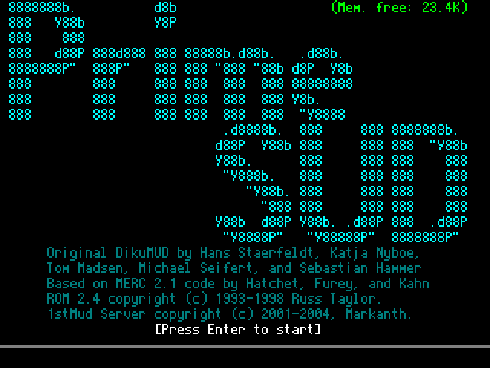
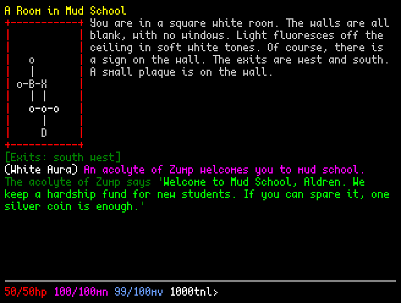
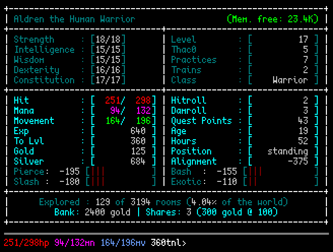
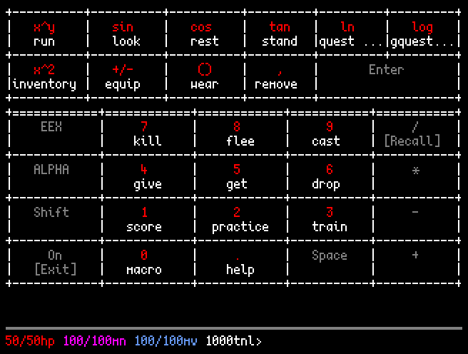

# PrimeSUD

PrimeSUD is a single-player MUD-like RPG for the HP Prime graphing calculator.

Based on ROM 2.4, with enhancements ported from 1stMud, it runs in a custom text UI built for the calculator's 320x240 screen.

## Screenshots






## Features

- Classes, races, remorting, multiclassing, and full spell and skill tables.
- Combat stances, quests, global quests, and trivia points.
- Bundled collection of stock areas, including Midgaard, Moria, the Shire, and New Thalos. Other ROM 2.4 area files can be prepared with `tools/are_to_primesud.py`.
- Automapping and per-room exploration tracking through the `explored` command.
- PC mode using shims for Prime-specific modules and the calculator's text layer.

Most multiplayer mechanics are cut or reworked for solo play.

[Version 1.0](https://github.com/ZechyW/primesud/releases/tag/v1.0.0) is the content-parity baseline against 1stMud 4.5.3, within those solo adaptations; later releases may go beyond it with new content and balance changes.

## Requirements

Calculator: an HP Prime (or the Virtual Calculator emulator) and the HP Connectivity Kit for file transfer.

PC: Python 3, no runtime dependencies. The dist build also needs `python-minifier`.

## Running on a PC

```
python run_source.py   # run src/ directly, no build
python run_dist.py     # build the minified dist first, then run it
```

`run_source.py` for everyday use. `run_dist.py` builds `dist/` and runs the minified copy, catching anything minification broke.

Saves live in the repo root (`primesud.sav`, gitignored), shared between both runners, so `dist/` stays a clean transfer copy.

## Deploying to a calculator

```
python tools/build_dist.py --zip           # build + pack the transfer zip
python tools/build_dist.py --check --zip   # also verify symbols + area data survived
```

Regenerates derived data (areas, world tables, mob index, help), writes `dist/primesud.hpappdir/`, then packs it as `dist/PrimeSUD-hpprime.zip`. Pass a tag to include it in the filename, e.g. `--zip dev` produces `dist/PrimeSUD-dev-hpprime.zip`.

Send that zip to the calculator with the Connectivity Kit, which unpacks the app folder itself. Prefer this over copying the folder across file by file -- one transfer leaves far less room for an individual file to corrupt or silently fail to send. Drop `--zip` if you do want the loose `dist/primesud.hpappdir/` folder.

Releases ship in zip format, so to skip the build entirely, download it from the [latest release](https://github.com/ZechyW/primesud/releases/latest).

The app runs on both G1 and G2 Primes, but it is large and requests more runtime heap than the default 1 MB.

If the calculator reports "Insufficient memory," power-cycle it first -- Shift+On to turn it off, then On -- before performing a soft reset with On+Symb. A soft reset restores user variables, including the game save, to their state at the last power-on checkpoint. Resetting before power-cycling may therefore risk losing save data.

## Read more

- [`FEATURES.md`](FEATURES.md) -- new systems, solo adaptations, and quality-of-life changes.
- [`docs/PRIME_UX.md`](docs/PRIME_UX.md) -- controls, shortcuts, scrollback, autosave, and other Prime-specific features.
- [`DESIGN.md`](DESIGN.md) -- where PrimeSUD deliberately differs from its source.
- [`TODO.md`](TODO.md) -- remaining work and planned features.
- [`docs/BUILTINS.md`](docs/BUILTINS.md) -- device limitations and measured performance details.

## Credits

PrimeSUD builds on 1stMud, ROM, Merc, and DikuMud; see [`LICENSES.md`](LICENSES.md) for their licenses and full credits.

Its text interface began with [Text Mode Layer (tml) 1.0](https://www.hpcalc.org/details/9661) by Piotr Kowalewski (komame), extensively adapted and extended for PrimeSUD.

## But why?

I had a Prime gathering dust on a shelf and a sudden bout of nostalgia for the good old days. Apparently, this was the logical next step. 🙂
